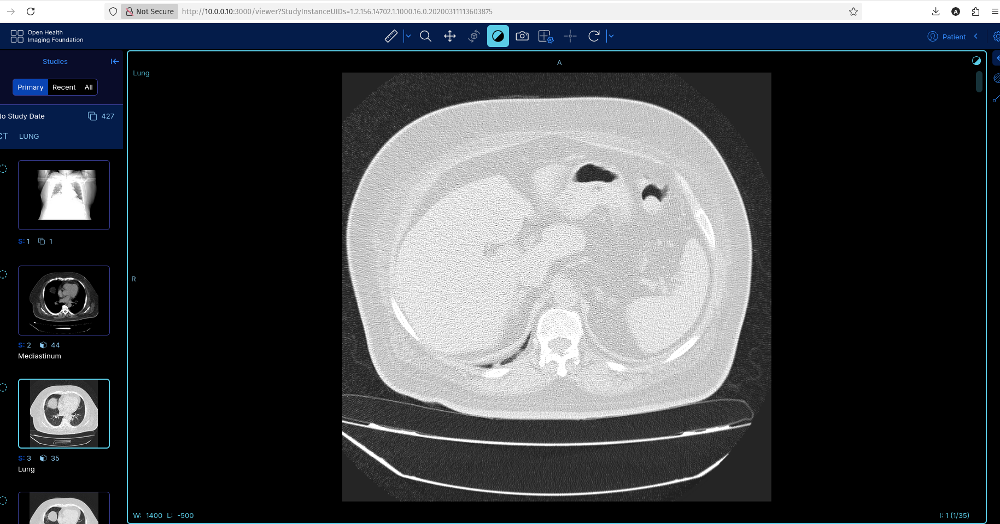

# DCM4CHEE PACS with OHIF Viewer - FOR DEMO - NO AUTHENTICATION

A complete,  DEMO for DICOM PACS (Picture Archiving and Communication System) using DCM4CHEE Archive with OHIF (Open Health Imaging Foundation) web viewer, deployed using Docker Compose.

## 🏥 System Overview

This deployment provides a full-featured medical imaging PACS system with:

- **DCM4CHEE Archive 5.34.0** - Enterprise DICOM archive
- **OHIF Viewer 3.8.0** - Modern web-based DICOM viewer
- **PostgreSQL 17.4** - Robust database backend
- **OpenLDAP** - Authentication and authorization
- **WildFly Application Server** - Java EE runtime


## 📁 Project Structure

```
CUSTOM-PACS/
├── docker-compose.yml          # Main service orchestration
├── docker-compose.env          # Environment variables template
├── .env                        # Active environment configuration (created by setup)
├── setup.sh                    # Automated setup script
├── README.md                   # This documentation
├── config/
│   ├── ohif-config.js         # OHIF viewer configuration
│   └── nginx.conf             # (placeholder for future use)
├── data/                       # Persistent data storage (created by setup)
│   ├── ldap/                  # LDAP database files
│   ├── slapd.d/               # LDAP configuration
│   ├── db/                    # PostgreSQL database
│   ├── wildfly/               # WildFly server configuration
│   └── storage/               # DICOM image storage
└── Covid Scans/               # Sample DICOM files (optional)
```

## 🚀 Quick Start

### Prerequisites

- **Docker** 20.10+ and **Docker Compose** 2.0+
- **Linux/macOS/Windows** with WSL2
- **8GB+ RAM** recommended
- **20GB+ free disk space**

### 1. Clone or Download

```bash
# If you have the project files
git clone https://github.com/allamiro/PACS-DEMO.git
cd PACS-DEMO
```

### 2. Run Setup Script

```bash
# Make setup script executable
chmod +x setup.sh

# Run automated setup
./setup.sh
```

The setup script will:
- ✅ Create required data directories
- ✅ Check Docker installation
- ✅ Configure timezone
- ✅ Create `.env` file from template
- ✅ Optionally set up system users

### 3. Start Services

```bash
# Start all services in background
docker compose up -d

# Monitor startup logs
docker compose logs -f
```

### 4. Verify Deployment

Wait 2-3 minutes for all services to start, then check:

```bash
# Check service status
docker compose ps

# All services should show "healthy" status
```

### 5. Setup WildFly Admin User

The WildFly management console requires an admin user to be created. Run this command to set up access:

```bash
# Create admin user for WildFly management console
docker compose exec arc /opt/wildfly/bin/add-user.sh -u admin -p admin -e -s

# Restart the arc service to apply changes
docker compose restart arc

# Wait for service to be healthy again
docker compose ps arc
```

## 🌐 Access Points

Once deployed, access these web interfaces:

| Service | URL | Credentials |
|---------|-----|-------------|
| **OHIF Viewer** | http://localhost:3000 | No login required |
| **DCM4CHEE Admin** | http://localhost:8080/dcm4chee-arc/ui2 | admin/admin |
| **WildFly Console** | http://localhost:9990 | admin/admin |

## 📊 Service Details

### DCM4CHEE Archive (Port 8080)
- **DICOM Port**: 11112 (C-STORE, C-FIND, C-MOVE)
- **HL7 Port**: 2575
- **Web Services**: REST API, WADO-URI, WADO-RS, QIDO-RS
- **AE Title**: DCM4CHEE

### OHIF Viewer (Port 3000)
- **Modern Web Interface**: HTML5 DICOM viewer
- **Features**: Multi-planar reconstruction, measurements, annotations
- **Protocols**: WADO-RS, QIDO-RS integration
- **Mobile Friendly**: Responsive design

### Database & Storage
- **PostgreSQL**: Metadata and configuration storage
- **File System**: DICOM images stored in `./data/storage/`
- **LDAP**: User authentication and permissions

## 🔧 Configuration

### Environment Variables

Edit `.env` file to customize:

**⚠️ Security Note**: The `.env` file is created locally by the setup script and contains sensitive information. It should never be committed to version control.

```bash
# Data storage location
DATA_DIR=./data

# Database settings
POSTGRES_DB=pacsdb
POSTGRES_USER=pacs
POSTGRES_PASSWORD=pacs

# DICOM configuration
AE_TITLE=DCM4CHEE
DICOM_PORT=11112

# Memory settings (adjust based on your system)
JAVA_OPTS=-Xms512m -Xmx2g
```

### OHIF Viewer Configuration

The OHIF viewer is configured via `config/ohif-config.js`. Key settings:

```javascript
// Update IP addresses for remote access
wadoUriRoot: 'http://YOUR_SERVER_IP:8080/dcm4chee-arc/aets/DCM4CHEE/wado'
qidoRoot: 'http://YOUR_SERVER_IP:8080/dcm4chee-arc/aets/DCM4CHEE/rs'
wadoRoot: 'http://YOUR_SERVER_IP:8080/dcm4chee-arc/aets/DCM4CHEE/rs'
```

## 📤 Sending DICOM Files

### Using dcm4che Tools

```bash
# Send single DICOM file
docker run --rm --network=dcm4chee-network \
  -v "/path/to/dicom/files:/data" \
  dcm4che/dcm4che-tools \
  storescu -cDCM4CHEE@arc:11112 "/data/file.dcm"

# Send entire directory
docker run --rm --network=dcm4chee-network \
  -v "/path/to/dicom/files:/data" \
  dcm4che/dcm4che-tools \
  storescu -cDCM4CHEE@arc:11112 "/data/"
```

### Using storescu command

```
storescu -aec DCM4CHEE IP_ADDRESS 11112 -v -xi 56364823.dcm
I: checking input files ...
I: Requesting Association
I: Association Accepted (Max Send PDV: 16366)
I: Sending file: 56364823.dcm
I: Converting transfer syntax: Little Endian Explicit -> Little Endian Implicit
I: Sending Store Request (MsgID 1, CT)
XMIT: .................................
I: Received Store Response (Success)
I: Releasing Association
```

### Using DICOM Clients

Configure your DICOM client with:
- **AE Title**: DCM4CHEE
- **Host**: localhost (or server IP)
- **Port**: 11112

## Configure for different devices (CT, X-ray, …)” — practical options

You don’t need separate AEs per modality to make this work—the archive reads modality from the DICOM tag (0008,0060) Modality in each file. That said, you might want per-modality AEs, ports, or routing. Here are three common patterns, from simplest to more advanced:

### Pattern 1 — Single AE for everything (recommended to start)

Keep AE Title = DCM4CHEE, Port = 11112 (already exposed).

On each modality (CT, CR, MR), set Remote AE to DCM4CHEE, host 167.172.186.105, port 11112.

Done. Studies will still show as CT/CR/MR because the files’ (0008,0060) are preserved.

### Pattern 2 — Multiple archive AEs (logical separation by AE Title)

Useful if you want CT to send to AE=CT_IN, X-ray to AE=CR_IN, etc.

Steps (in dcm4chee UI):

Open Configuration → Devices → dcm4chee-arc → Edit.

Under Application Entities, Add a new AE:

AE Title: e.g., CT_IN

#### Association Acceptor: ✓

Network Connection: select the existing dcm4chee-arc listener.

You can keep the same port 11112 (dcm4chee can accept multiple AETs on one listener).

Repeat for CR_IN, MR_IN as desired.

On the CT console, set Remote AE to CT_IN (host/port unchanged); on X-ray, set CR_IN, etc.

Optional: add WebApps → DCM4CHEE_ARC_AET entries if you want DICOMweb endpoints tied to those AETs as well (e.g., …/aets/CT_IN/rs), but it’s not required for plain DIMSE C-STORE.

### Pattern 3 — Storage/Routing rules per modality (advanced ops)

If you want CT images to land in a different storage bucket or trigger different retention:

UI → Configuration → dcm4chee-arc → Archiving:

Define additional Storage Descriptors (e.g., fs_ct, fs_cr) pointing at different file system paths (or S3/MinIO if you use object storage).

UI → Configuration → dcm4chee-arc → HL7 & DICOM Rules:

Create a Storage ID Rule or Archive Rule with a condition on Modality = CT (or Calling AE Title = CT_IN) → set storageID=fs_ct.

Likewise for CR → fs_cr.

(Optional) Define Export Rules if you want automatic forwarding, e.g., route CR to an external QA node.

6) Typical modality console settings

On the CT / X-ray device (sender) you will set:

Called AE Title: DCM4CHEE (or CT_IN, CR_IN if you created separate AEs)

Host/IP: IP ADDRESS x.x.x.x

Port: 11112

Transfer Syntax: usually “Implicit VR Little Endian” and/or “Explicit VR Little Endian” are fine.

Association Test: run a “Verify” from the modality; it should succeed.

## 🔍 Monitoring & Troubleshooting

### Check Service Health

```bash
# View all service status
docker compose ps

# Check specific service logs
docker compose logs arc
docker compose logs ohif-viewer
docker compose logs db
docker compose logs ldap

# Follow logs in real-time
docker compose logs -f
```

### Common Issues

#### OHIF Viewer Shows Black Screen
```bash
# Check OHIF logs
docker compose logs ohif-viewer

# Restart OHIF service
docker compose restart ohif-viewer

# Verify CORS configuration
curl -H "Origin: http://localhost:3000" \
     -H "Access-Control-Request-Method: GET" \
     -X OPTIONS \
     http://localhost:8080/dcm4chee-arc/aets/DCM4CHEE/rs/studies
```

#### Cannot Send DICOM Files
```bash
# Test DICOM connectivity
telnet localhost 11112

# Check DCM4CHEE logs for connection attempts
docker compose logs arc | grep DICOM
```

#### Services Won't Start
```bash
# Check system resources
docker system df
docker system prune  # Clean up if needed

# Verify port availability
netstat -tulpn | grep -E ':(3000|8080|11112|5432|389)'
```

## 🔒 Security Considerations

### Production Deployment

For production use, consider:

1. **Change Default Passwords**:
   ```bash
   # Update in .env file
   POSTGRES_PASSWORD=secure_random_password
   LDAP_ROOTPASS=secure_random_password
   ```

2. **Enable HTTPS**:
   - Configure SSL certificates
   - Update OHIF config for HTTPS endpoints
   - Use reverse proxy (nginx/Apache)

3. **Network Security**:
   - Use firewall rules
   - Limit port exposure
   - Consider VPN access

4. **Backup Strategy**:
   ```bash
   # Backup data directory
   tar -czf pacs-backup-$(date +%Y%m%d).tar.gz data/
   ```

## 📋 Management Commands

### Service Management

```bash
# Start services
docker compose up -d

# Stop services (preserves data)
docker compose stop

# Restart specific service
docker compose restart arc

# Update services
docker compose pull
docker compose up -d

# Complete removal (⚠️ DELETES ALL DATA)
docker compose down -v
```

### Data Management

```bash
# Backup database
docker compose exec db pg_dump -U pacs pacsdb > backup.sql

# Restore database
docker compose exec -T db psql -U pacs pacsdb < backup.sql

# View storage usage
du -sh data/storage/
```

## 🧪 Testing with Sample Data

### COVID-19 CT Scans (Included)

If you have the COVID scans in the project:

```bash
# Send all COVID DICOM files
docker run --rm --network=dcm4chee-network \
  -v "$(pwd)/Covid Scans:/data" \
  dcm4che/dcm4che-tools \
  storescu -cDCM4CHEE@arc:11112 "/data/Covid Scans/Subject (1)/98.12.2/"
```

### Verify Studies in OHIF

1. Open OHIF: http://localhost:3000
2. You should see studies in the study list
3. Click on a study to view CT images
4. Use mouse controls:
   - **Scroll**: Navigate slices
   - **Left drag**: Pan image
   - **Right drag**: Window/level
   - **Wheel**: Zoom

## 🔧 Advanced Configuration

### Custom DICOM Configuration

Edit DCM4CHEE configuration via web interface:
1. Go to http://localhost:8080/dcm4chee-arc/ui2
2. Login as admin/admin
3. Navigate to Configuration → Devices → dcm4chee-arc

### OHIF Extensions

To add OHIF extensions, modify `config/ohif-config.js`:

```javascript
extensions: [
  '@ohif/extension-cornerstone',
  '@ohif/extension-measurement-tracking'
],
modes: [
  '@ohif/mode-longitudinal'
]
```

### Performance Tuning

For high-volume environments:

```bash
# Increase Java heap size in .env
JAVA_OPTS=-Xms2g -Xmx8g -XX:MetaspaceSize=256M

# Use SSD storage for database
# Mount fast storage to ./data/db/
```

## 🆘 Support & Resources

### Documentation Links
- [DCM4CHEE Archive](https://github.com/dcm4che/dcm4chee-arc-light/wiki)
- [OHIF Viewer](https://docs.ohif.org/)
- [DICOM Standard](https://www.dicomstandard.org/)

### Community Support
- [DCM4CHE Forum](https://groups.google.com/g/dcm4che)
- [OHIF Community](https://community.ohif.org/)

### Troubleshooting Checklist

- [ ] All services show "healthy" status
- [ ] Ports 3000, 8080, 11112 are accessible
- [ ] DICOM files are valid format
- [ ] Sufficient disk space available
- [ ] System has adequate RAM (8GB+)
- [ ] Docker daemon is running
- [ ] No port conflicts with other services

## 📝 License & Acknowledgments

This deployment configuration is provided as-is for educational and research purposes.

**Components Used:**
- **DCM4CHEE**: Apache License 2.0
- **OHIF**: MIT License
- **PostgreSQL**: PostgreSQL License
- **OpenLDAP**: OpenLDAP Public License

---

**🏥 Happy DICOM Viewing! 🏥**

For issues or improvements, please check the troubleshooting section or consult the official documentation links above.
